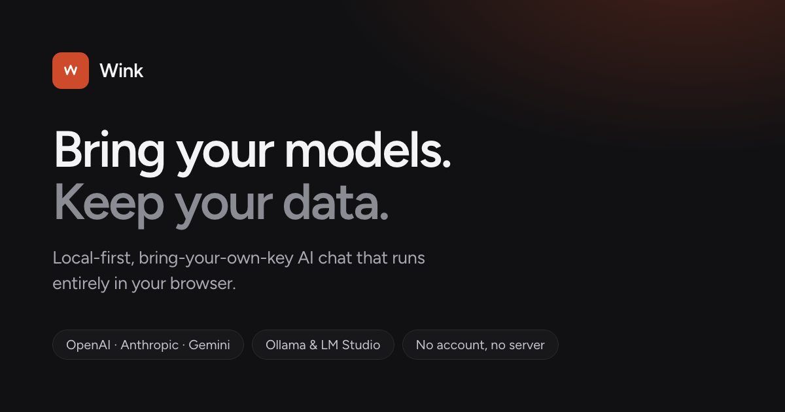

<p align="center">
  
</p>

<h1>wink</h1>

**Bring your models. Keep your data.**

A multi-model AI workspace that runs entirely in your browser. No server, no
account, no telemetry. Your conversations, memories and documents live in this
device's IndexedDB, and you decide which model ever sees them.

```bash
npm install
npm run dev
```

## What's inside

- **Any model.** OpenAI, Anthropic, Gemini, anything OpenAI-compatible
  (OpenRouter, Groq, DeepSeek, Mistral, xAI…), plus Ollama and LM Studio on
  localhost. Capabilities are detected per model.
- **Real chat.** Streaming, markdown, highlighted code, artifacts with a
  sandboxed preview, reasoning traces, retries, cancel, regenerate, edit,
  branching, and a compare mode that answers with several models at once.
- **Memory.** Durable facts are extracted from your chats, stored locally, and
  only the relevant ones get injected. Pin, edit or forget any of them.
- **Knowledge.** Drop in PDFs, Markdown, text or code; chunked and embedded in
  a worker, retrieved with cosine + BM25, answered with citations.
- **Tools.** Web search, page reading, local document search, calculator,
  sandboxed JavaScript, and any MCP server over HTTP. Every call asks first and
  shows its input, output and duration.
- **Research mode.** Plan → search → read → reflect → synthesize, every step
  visible, every claim cited.
- **Yours.** Per-provider switches for what may leave the device, API keys
  encrypted with a device key (optionally behind a passphrase vault), full
  backup/restore, Markdown/JSON export, ChatGPT import.

## Good to know

Requests go straight from your browser to the provider, so local servers need
CORS on (`OLLAMA_ORIGINS=*`). A browser can't crawl, so web search and page
reading run through an endpoint you pick. Embeddings default to a built-in
local hashing embedder; point it at a real embedding model for semantic recall.

Design system in [`design.md`](design.md). Stack: React 19, Vite, Tailwind 4,
Base UI, IndexedDB.
